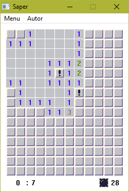
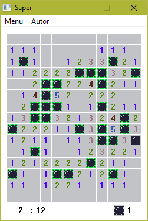
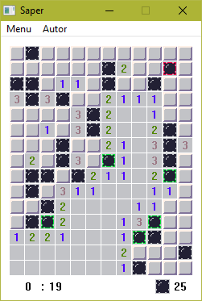

# MasmSaper

Projekt zaliczeniowy z "Programowania niskopoziomowego".
Jest to gra saper napisana w assemblerze. Celem gry jest odnalezienie wszystkich min ukrytych na planszy.

# Zdjęcia

## Widok gry

## Wygrana

## Przegrana

# Instalacja

1. Pobrać i zainstalować [Masm32]
2. Skompilować grę przy użyciu pliku `makeit.bat`
3. Uruchomić grę z pliku `MasmSaper.exe`

[Masm32]: http://www.masm32.com/download.htm